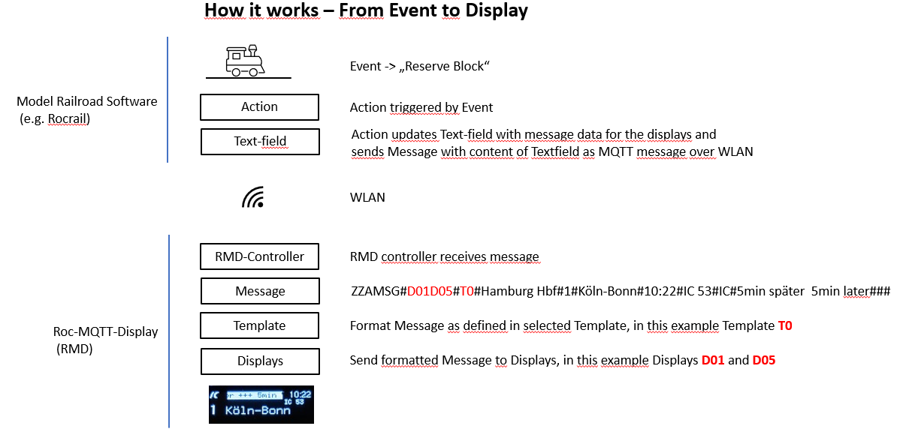

# Roc-MQTT-Display

Copyright (c) 2020-2024 Christian Heinrichs.
All rights reserved.

Dynamic Passenger Information system for Model Railroad Stations controlled by Rocrail, Node-RED or any other program that can send MQTT messages.
Wireless communication with Rocrail, Node-RED or other sources via MQTT messages.
An ESP32 or Lolin/Wemos D1 mini ESP8266 controller and a TCA9548A I2C Multiplexer can drive up to eight I2C OLED displays. 
Several controllers can run in parallel so the total number of displays is not limited.  
A friend of mine was looking for an easy way to run displays with live data in his model railroad environment. Right after this conversation this project was born.
Since then it's work in progress with already many nice features. If you want to share your experience with this code or have ideas for more features you are welcome to share them in the Issues or Discussions area. Have fun.

### Roc-MQTT-Display (RMD)  

Latest Version 1.12  
June 02, 2024 

Thank you for your interest in the Roc-MQTT-Display project.
If you like the project please Star it here on GitHub and consider donating if you want to support further development.
Donations are more than welcome and I will use them to buy new displays, controllers and sensors for development and testing and of course for a lot of coffee... :-)

  

**The goal of this project is to provide simple to use and inexpensive displays for railroad stations to run in a Model Railroad environment.**  

**Current features**  
- Content and messages can be static or dynamic
- Formatting is saved in templates so the user can focus on sending the right data to the display and just pick a template for formatting.
- The architecture is extremely scalable:
	* 1-8 displays per controller
	* Theoretically unlimited number of controllers can run in parallel (didn't have so many for testing :-) )
	* Up to 10 different Fonts
	* Up to 10 Templates
	* Up to 20 Logos
- Individual Scrolltext for static or dynamic content on all connected displays
- Rocrail dynamic variables support
- German Umlaut support
- Clock/Date available for all displays (NTP time or Railroad time)
- Display rotation
- Brightness controllable per display 
- Screensaver
- Tested with these displays: I2C Oled 128x32 0.87 and 0.91, 128x64, 64x48, 96x16, (64x32, 72x40)
- Also works with 2x and 4x OLED Adapters from this project https://wiki.mobaledlib.de/anleitungen/oled/oled-adapter
- Webinterface for configuration via browser
- Updates via OTA
- Demo Mode

Architecture, Hard- and Software Requirements, Installation and Configuration are documented in the [**Wiki**](https://github.com/chrisweather/RocMQTTdisplay/wiki).

Several more ideas and features are on the to do list.
Please share your experience, bugs and ideas for improvements via GitHub Issues function in English or Deutsch.  

Roc-MQTT-Display in action in Volkers model railroad installation. Thanks for sharing.  

This project is also compatible now with the great display adaptors from this project [MobaLedLib 0.87" OLED-Adapter](https://wiki.mobaledlib.de/anleitungen/oled/oled-adapter).  
Here you can find [**4 displays in action**](https://github.com/chrisweather/RocMQTTdisplay/assets/23246503/4d15ef67-ca1c-4e37-88cf-b6d6ea18246c). 
Based on the OLED-Adapter with four 0.87" 128x32 displays.  
